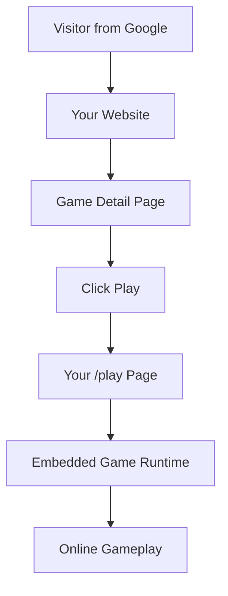

# GGEMU ShipFast

<p align="center">
  English · <a href="./README.zh-CN.md">简体中文</a>
</p>

<p align="center">
  <strong>Launch your gaming website in minutes.</strong><br />
  Spend your time growing it, not maintaining it.
</p>

<p align="center">
  <a href="https://deploy.workers.cloudflare.com/?url=https://github.com/GGEMU-FAMILY/ggemu-shipfast">
    
  </a>
</p>

<p align="center">
  <a href="#why-shipfast">Why ShipFast</a> ·
  <a href="#how-it-works">How it works</a> ·
  <a href="#customization">Customization</a> ·
  <a href="#openapi">OpenAPI</a> ·
  <a href="#deployment">Deployment</a> ·
  <a href="#faq">FAQ</a>
</p>

---

## What is ShipFast?

**GGEMU ShipFast** is a ready-to-use gaming website starter built for people who want to launch and grow their own game site quickly.

It gives you a complete frontend, shared game data, blog content, online play integration, theme options, and Cloudflare-ready deployment.

You only need:

- A domain
- A Cloudflare account
- A few environment variables

No database.  
No VPS.  
No ROM management.  
No emulator maintenance.

---

## Why ShipFast?

Building a gaming website is easy.

Maintaining one is not.

Most game websites eventually require constant work:

- Updating game data
- Maintaining emulator compatibility
- Fixing mobile issues
- Optimizing game loading
- Managing metadata
- Adding new games
- Improving layouts
- Handling infrastructure

ShipFast removes the hardest parts so you can focus on what actually grows your site:

- SEO
- Branding
- Content
- Marketing
- Community
- Monetization

---

## How it works



Your visitors stay on your own domain.

Your website owns the brand, pages, layout, SEO, ads, and user experience.

The game runtime is embedded into your `/play` page, so the hardest part of the gaming experience can keep improving without requiring you to maintain it yourself.

---

## What you own

ShipFast is designed for independent site owners.

You can control:

- Domain
- Site name
- Logo
- Slogan
- Theme
- Layout
- Navigation
- Components
- SEO strategy
- Advertising placements
- Custom pages
- Source code

ShipFast gives you a starting point, not a locked platform.

---

## What ShipFast handles

ShipFast provides a working foundation for:

- Game listing pages
- Game detail pages
- Blog pages
- Search and discovery
- Game metadata
- Platform categories
- Theme switching
- Cloudflare deployment
- Online play integration
- RefCode-based attribution
- Ad platform configuration

It is built for fast launch, but still gives developers full control over the source code.

---

## One domain is enough

Because ShipFast uses shared game and blog data, you do not need to set up a database or content backend.

That means a new site can start with only one domain and a Cloudflare deployment.

```text
Your Domain
    ↓
Cloudflare Workers
    ↓
ShipFast Website
    ↓
Shared Game Data + Online Play
```

This makes it especially suitable for:

- SEO experiments
- Niche gaming sites
- Region-specific game portals
- Multi-site deployment
- Indie publishers
- Developers building fast MVPs

---

## Customization

ShipFast includes multiple ways to make your site feel different from others.

### Built-in options

- 3 layout templates
- Dozens of theme color combinations
- Configurable site name
- Configurable slogan
- Configurable logo
- Configurable analytics
- Configurable ad settings
- Configurable RefCode

### Full source control

You can clone the project and modify anything:

- Homepage
- Game cards
- Navigation
- Footer
- Detail pages
- Blog layout
- Theme system
- Components
- Routes

### AI coding friendly

ShipFast is designed to be easy to customize with modern coding agents.

Start from the default templates, then ask your coding assistant to create a unique visual style, layout, landing page, or niche-specific gaming experience.

The recommended path is:

```text
Deploy quickly
    ↓
Change brand and theme
    ↓
Customize layout with a coding agent
    ↓
Build a site that feels unique
```

---

## Monetization

ShipFast supports two practical monetization layers.

### Your own website ads

You can place your own ads on your own pages.

Examples:

- Display ads
- Native ads
- Affiliate links
- Sponsored placements
- Custom banners

Revenue from your own website pages is fully yours.

### Gameplay attribution

ShipFast supports `GGEMU_REFCODE`.

When configured, gameplay traffic can be attributed to your site for revenue sharing where supported.

This keeps the model simple:

```text
You grow the traffic.
ShipFast helps you launch faster.
Gameplay attribution tracks your contribution.
```

---

## OpenAPI

ShipFast is built on top of the public GGEMU OpenAPI.

That means ShipFast is not the only way to build.

There are two paths:

| Path | Best for | Description |
| --- | --- | --- |
| ShipFast | Fast launch | Ready-to-use starter with layouts, themes, routes, and deployment |
| OpenAPI | Deep customization | Build your own frontend directly from the public API |

Advanced developers can skip ShipFast and build a fully custom gaming site using the OpenAPI directly.

ShipFast is simply the fastest starting point.

---

## Future kits

ShipFast is the first starter in the GGEMU-FAMILY ecosystem.

Future kits may include:

- Mobile app starter
- App store publishing starter
- More website themes
- More layout systems
- More API examples
- More monetization examples

The goal is simple:

> Make it easier for independent publishers to build gaming products without rebuilding the same infrastructure again and again.

---

## Tech stack

- React 19
- TanStack Start
- TanStack Router
- Vite
- TypeScript
- Cloudflare Workers

---

## Supported game platforms

ShipFast supports online game discovery across many classic and web game platforms, including:

- Arcade
- Flash
- DOS
- HTML5
- GB
- GBC
- GBA
- FC
- SFC
- NDS
- N64
- Virtual Boy
- Sega Game Gear
- Sega Genesis
- Sega Master System
- Sega 32X
- Sega CD
- Sega Saturn
- PlayStation
- PSP
- PC Engine
- Neo Geo Pocket
- WonderSwan

---

## Deployment

ShipFast is designed for Cloudflare Workers.

Click the button below, connect your repository, configure environment variables, and deploy.

<p>
  <a href="https://deploy.workers.cloudflare.com/?url=https://github.com/GGEMU-FAMILY/ggemu-shipfast">
    
  </a>
</p>

---

## Configuration

Default site settings live in `siteconfig.js`.

Runtime environment variables with the same names take priority over `siteconfig.js`.

### Common settings

| Variable | Description |
| --- | --- |
| `SITE_NAME` | Your website name |
| `SITE_SLOGAN` | Your website slogan |
| `SITE_EMAIL` | Contact email |
| `SITE_TEMPLATE` | Layout template |
| `SITE_THEMES` | Theme color configuration |
| `GGEMU_REFCODE` | RefCode for attribution |
| `GOOGLE_ADSENSE_CLIENT` | Google AdSense client ID |
| `GOOGLE_ANALYTICS_ID` | Google Analytics ID |

### Template options

`SITE_TEMPLATE` currently supports:

- `default`
- `two-column`
- `poki-like`
- `features`
- `sidenav`

On Cloudflare Workers, configure these as Worker variables or secrets.

The app reads Cloudflare runtime bindings first, then falls back to `process.env`, then to `siteconfig.js`.

---

## Recommended launch flow

```text
1. Prepare a domain
2. Deploy ShipFast to Cloudflare
3. Configure SITE_NAME, logo, theme, and RefCode
4. Connect analytics
5. Add your own ads
6. Customize the layout
7. Start publishing and growing traffic
```

---

## FAQ

### Is ShipFast a full gaming website?

Yes. It provides a complete website foundation with game listing, detail pages, blog pages, themes, and online play integration.

### Do I need a database?

No. ShipFast uses shared game and blog data, so you do not need to deploy your own database.

### Do I need a VPS?

No. ShipFast is designed to run on Cloudflare Workers.

### Can I change the brand?

Yes. You can change the site name, logo, slogan, theme, layout, and source code.

### Can I hide GGEMU branding?

ShipFast does not force GGEMU branding on your site. Attribution is appreciated where appropriate, but the site owner controls the presentation.

### Can I use my own ads?

Yes. You control ad placements on your own pages.

### Can I customize everything?

Yes. Basic users can configure the site through variables. Developers can modify the source code directly.

### Can I build without ShipFast?

Yes. Advanced developers can use the public GGEMU OpenAPI directly.

### Does ShipFast include cloud saves?

ShipFast currently focuses on fast deployment and anonymous gameplay. Local saves and exported save files are supported where available. Account-based cloud saves are not enabled in ShipFast by default.

### Why is the play page embedded?

The online play experience requires long-term maintenance across browsers, devices, controls, and emulator behavior. Keeping the runtime maintained separately helps improve compatibility without requiring every site owner to solve those problems independently.

---

## License

Licensed under the Apache License, Version 2.0.

See [LICENSE](./LICENSE) for details.

Attribution notices are provided in [NOTICE](./NOTICE). Redistributed copies or derivative works must retain the required copyright, license, and attribution notices as described by the license.

---

<p align="center">
  <strong>Launch fast. Customize freely. Grow your own gaming website.</strong>
</p>
