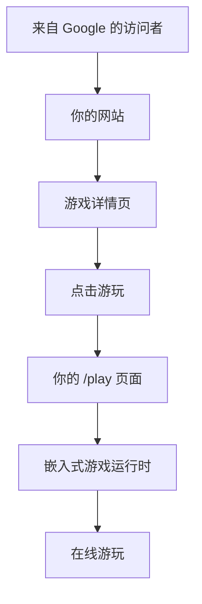

# GGEMU ShipFast

<p align="center">
  <a href="./README.md">English</a> · 简体中文
</p>

<p align="center">
  <strong>几分钟内上线你的游戏网站。</strong><br />
  把时间花在增长上，而不是维护上。
</p>

<p align="center">
  <a href="https://deploy.workers.cloudflare.com/?url=https://github.com/GGEMU-FAMILY/ggemu-shipfast">
    
  </a>
</p>

<p align="center">
  <a href="#为什么选择-shipfast">为什么选择 ShipFast</a> ·
  <a href="#工作原理">工作原理</a> ·
  <a href="#自定义">自定义</a> ·
  <a href="#openapi">OpenAPI</a> ·
  <a href="#部署">部署</a> ·
  <a href="#常见问题">常见问题</a>
</p>

---

## ShipFast 是什么？

**GGEMU ShipFast** 是一个开箱即用的游戏网站启动模板，适合希望快速发布并运营自己游戏站点的人。

它提供完整前端、共享游戏数据、博客内容、在线游玩集成、主题选项，以及面向 Cloudflare 的部署能力。

你只需要：

- 一个域名
- 一个 Cloudflare 账号
- 少量环境变量

不需要数据库。  
不需要 VPS。  
不需要管理 ROM。  
不需要维护模拟器。

---

## 为什么选择 ShipFast？

搭建一个游戏网站很容易。

长期维护并不容易。

大多数游戏网站最终都会需要持续处理：

- 更新游戏数据
- 维护模拟器兼容性
- 修复移动端问题
- 优化游戏加载
- 管理元数据
- 添加新游戏
- 改进页面布局
- 处理基础设施

ShipFast 移除了最难维护的部分，让你专注于真正能推动站点增长的事情：

- SEO
- 品牌
- 内容
- 营销
- 社区
- 变现

---

## 工作原理



访客会留在你自己的域名下。

你的网站拥有品牌、页面、布局、SEO、广告和用户体验。

游戏运行时会嵌入到你的 `/play` 页面，因此游戏体验中最难维护的部分可以持续改进，而不需要你自己维护。

---

## 你拥有的部分

ShipFast 面向独立站点所有者设计。

你可以控制：

- 域名
- 站点名称
- Logo
- 标语
- 主题
- 布局
- 导航
- 组件
- SEO 策略
- 广告位
- 自定义页面
- 源代码

ShipFast 给你的是起点，不是封闭平台。

---

## ShipFast 处理的部分

ShipFast 提供可直接运行的基础能力：

- 游戏列表页
- 游戏详情页
- 博客页面
- 搜索和发现
- 游戏元数据
- 平台分类
- 主题切换
- Cloudflare 部署
- 在线游玩集成
- 基于 RefCode 的归因
- 广告平台配置

它适合快速上线，同时仍然让开发者完全控制源代码。

---

## 一个域名就够了

因为 ShipFast 使用共享游戏和博客数据，你不需要搭建数据库或内容后台。

这意味着，一个新站点只需要一个域名和一次 Cloudflare 部署就能启动。

```text
你的域名
    ↓
Cloudflare Workers
    ↓
ShipFast 网站
    ↓
共享游戏数据 + 在线游玩
```

这尤其适合：

- SEO 实验
- 垂直游戏站点
- 面向特定地区的游戏门户
- 多站点部署
- 独立发行者
- 快速构建 MVP 的开发者

---

## 自定义

ShipFast 提供多种方式，让你的网站看起来不同于其他站点。

### 内置选项

- 3 套布局模板
- 多组主题配色
- 可配置站点名称
- 可配置标语
- 可配置 Logo
- 可配置统计
- 可配置广告设置
- 可配置 RefCode

### 完整源码控制

你可以克隆项目并修改任何内容：

- 首页
- 游戏卡片
- 导航
- 页脚
- 详情页
- 博客布局
- 主题系统
- 组件
- 路由

### 适合 AI 编程助手

ShipFast 的结构适合用现代编程助手进行自定义。

你可以从默认模板开始，然后让编程助手创建独特的视觉风格、布局、落地页，或面向特定领域的游戏体验。

推荐流程是：

```text
快速部署
    ↓
修改品牌和主题
    ↓
用编程助手自定义布局
    ↓
打造有独特感的网站
```

---

## 变现

ShipFast 支持两类实用的变现方式。

### 你自己网站上的广告

你可以在自己的页面上放置自己的广告。

例如：

- 展示广告
- 原生广告
- 联盟链接
- 赞助位
- 自定义横幅

你自己网站页面产生的收入完全归你所有。

### 游戏流量归因

ShipFast 支持 `GGEMU_REFCODE`。

配置后，在支持的场景中，游戏流量可以归因到你的站点，用于收益分成。

这个模型很简单：

```text
你负责增长流量。
ShipFast 帮你更快上线。
游戏流量归因记录你的贡献。
```

---

## OpenAPI

ShipFast 基于公开的 GGEMU OpenAPI 构建。

这意味着 ShipFast 不是唯一的构建方式。

你有两条路径：

| 路径 | 最适合 | 说明 |
| --- | --- | --- |
| ShipFast | 快速上线 | 带布局、主题、路由和部署能力的开箱即用模板 |
| OpenAPI | 深度自定义 | 直接基于公开 API 构建自己的前端 |

高级开发者可以跳过 ShipFast，直接使用 OpenAPI 构建完全自定义的游戏网站。

ShipFast 只是最快的起点。

---

## 未来套件

ShipFast 是 GGEMU-FAMILY 生态中的第一个启动模板。

未来可能会包含：

- 移动 App 启动模板
- 应用商店发布模板
- 更多网站主题
- 更多布局系统
- 更多 API 示例
- 更多变现示例

目标很简单：

> 让独立发行者更容易构建游戏产品，而不是反复重建同一套基础设施。

---

## 技术栈

- React 19
- TanStack Start
- TanStack Router
- Vite
- TypeScript
- Cloudflare Workers

---

## 支持的游戏平台

ShipFast 支持多个经典和网页游戏平台的在线游戏发现，包括：

- Arcade
- Flash
- DOS
- HTML5
- GB
- GBC
- GBA
- FC
- SFC
- NDS
- N64
- Virtual Boy
- Sega Game Gear
- Sega Genesis
- Sega Master System
- Sega 32X
- Sega CD
- Sega Saturn
- PlayStation
- PSP
- PC Engine
- Neo Geo Pocket
- WonderSwan

---

## 部署

ShipFast 面向 Cloudflare Workers 设计。

点击下面的按钮，连接你的仓库，配置环境变量，然后部署。

<p>
  <a href="https://deploy.workers.cloudflare.com/?url=https://github.com/GGEMU-FAMILY/ggemu-shipfast">
    
  </a>
</p>

---

## 配置

默认站点配置位于 `siteconfig.js`。

同名运行时环境变量的优先级高于 `siteconfig.js`。

### 常用配置

| 变量 | 说明 |
| --- | --- |
| `SITE_NAME` | 网站名称 |
| `SITE_SLOGAN` | 网站标语 |
| `SITE_EMAIL` | 联系邮箱 |
| `SITE_TEMPLATE` | 布局模板 |
| `SITE_THEMES` | 主题配色配置 |
| `GGEMU_REFCODE` | 用于归因的 RefCode |
| `GOOGLE_ADSENSE_CLIENT` | Google AdSense client ID |
| `GOOGLE_ANALYTICS_ID` | Google Analytics ID |

### 模板选项

`SITE_TEMPLATE` 当前支持：

- `default`
- `two-column`
- `poki-like`

在 Cloudflare Workers 上，请将这些配置为 Worker 变量或密钥。

应用会先读取 Cloudflare 运行时绑定，然后回退到 `process.env`，最后回退到 `siteconfig.js`。

---

## 推荐上线流程

```text
1. 准备域名
2. 将 ShipFast 部署到 Cloudflare
3. 配置 SITE_NAME、Logo、主题和 RefCode
4. 接入统计
5. 添加你自己的广告
6. 自定义布局
7. 开始发布并增长流量
```

---

## 常见问题

### ShipFast 是完整的游戏网站吗？

是。它提供完整的网站基础，包括游戏列表、详情页、博客页面、主题和在线游玩集成。

### 我需要数据库吗？

不需要。ShipFast 使用共享游戏和博客数据，因此你不需要部署自己的数据库。

### 我需要 VPS 吗？

不需要。ShipFast 设计为运行在 Cloudflare Workers 上。

### 我可以修改品牌吗？

可以。你可以修改站点名称、Logo、标语、主题、布局和源代码。

### 我可以隐藏 GGEMU 品牌吗？

ShipFast 不会强制在你的网站上展示 GGEMU 品牌。合适的场景下欢迎保留归因，但站点所有者控制最终展示方式。

### 我可以使用自己的广告吗？

可以。你可以控制自己页面上的广告位。

### 我可以自定义所有内容吗？

可以。普通用户可以通过变量配置站点。开发者可以直接修改源代码。

### 我可以不使用 ShipFast 构建吗？

可以。高级开发者可以直接使用公开的 GGEMU OpenAPI。

### ShipFast 包含云存档吗？

ShipFast 当前专注于快速部署和匿名游玩。在可用的情况下支持本地存档和导出存档。基于账号的云存档默认未在 ShipFast 中启用。

### 为什么游玩页面是嵌入式的？

在线游玩体验需要长期维护浏览器、设备、控制方式和模拟器行为的兼容性。将运行时单独维护，有助于持续改进兼容性，而不需要每个站点所有者都独立解决这些问题。

---

## 许可证

本项目基于 Apache License, Version 2.0 授权。

详情见 [LICENSE](./LICENSE)。

归因声明见 [NOTICE](./NOTICE)。根据许可证要求，重新分发副本或衍生作品必须保留必要的版权、许可证和归因声明。

---

<p align="center">
  <strong>快速上线。自由自定义。增长你自己的游戏网站。</strong>
</p>
